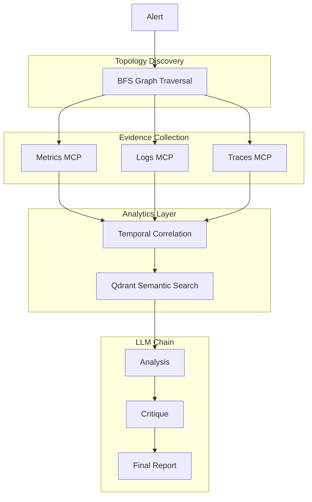

[](https://www.python.org/)
[](https://fastapi.tiangolo.com/)
[](https://kind.sigs.k8s.io/)
[](https://console.groq.com/)
[](LICENSE)
[](tests/fault-injection/)
[](#-resultados-nos-3-casos-de-teste)

RCA Inteligente com IA, Grafos e MCP | Multi-Agent Root Cause Analysis

> **Lema do Projeto:** *"A parte mais inteligente do agente não é a IA."*
> A IA não adivinha: ela apenas narra, contextualiza e traduz o que a engenharia de dados e a matemática do pipeline já provaram deterministicamente.

Este guia orienta a inicialização do ambiente local, a subida da infraestrutura distribuída e a execução dos testes de injeção de falhas para validar o agente de Root Cause Analysis (RCA).

---

## 🛠️ Stack Tecnológica & Requisitos

### Pré-requisitos Obrigatórios
* **Container Runtime:** Docker Desktop ou Docker Engine
* **Kubernetes Local:** [Kind](https://kind.sigs.k8s.io/) (`brew install kind` ou equivalente)
* **Gerenciadores:** `kubectl` + [Helm 3](https://helm.sh/)
* **Runtime:** Python 3.11+
* **Inferência:** Conta na [Groq Cloud](https://console.groq.com/) (Chave de API do Free Tier)

### Componentes do Ecossistema
* **Infraestrutura:** Cluster Kind (Single-node) + OpenTelemetry Demo App (24 microserviços simulando um e-commerce).
* **Observabilidade:** Prometheus (Métricas) · Loki (Logs) · Tempo (Traces).
* **Camada de Fatos (MCPs):** 4 servidores FastAPI independentes atuando como Model Context Protocol para isolar o acesso à telemetria e ao vetor de memória.
* **Storage Vetorial:** Qdrant (Armazenamento de incidentes históricos para RAG).
* **LLM Engine:** Groq (LLaMA 3.1 8B Instant).

---

## 🏗️ 1. Inicialização da Infraestrutura

Execute os comandos a partir da raiz do repositório `rca-agent/`:

```bash
# 1. Criar o cluster Kubernetes local via Kind
kind create cluster --config infra/kind/cluster.yaml

# 2. Instalar a stack de observabilidade e a aplicação alvo (OTel Demo)
# (Este script configura Helm Charts para Prometheus, Loki, Tempo e o Demo App)
bash infra/scripts/install.sh

## Stack

| Camada | Tecnologia |
|--------|-----------|
| Cluster | Kind (single-node) |
| App alvo | OpenTelemetry Demo (24 microserviços) |
| Métricas | Prometheus + kube-prometheus-stack |
| Logs | Loki |
| Traces | Tempo |
| Memória | Qdrant (vetorial) |
| MCPs | FastAPI (4 servidores) |
| LLMs | Groq — LLaMA 3.1 8B Instant |
| Pipeline | Python + asyncio + httpx |

## Tempos observados

| Caso | Tempo | Resultado |
|------|-------|-----------|
| Checkout → Payment bloqueado | 0.4s | H1: payment (70%) ✅ |
| Cart derrubado → checkout falha | 0.42s | H1: cart (60%) ✅ |
| Cache cascade → frontend lento | 4.4s | H1: catalog (80%) ✅ |
EOF

echo "✅ docs/architecture.md criado"

cat > docs/quickstart.md << 'EOF'
# Quickstart

## Pré-requisitos

- Docker Desktop ou Docker Engine
- Kind: `brew install kind` ou https://kind.sigs.k8s.io
- kubectl + Helm 3
- Python 3.11+
- Conta Groq (free tier): https://console.groq.com

## 1. Cluster e infra

```bash
kind create cluster --config infra/kind/cluster.yaml
bash infra/scripts/install.sh


Como funciona

Alerta → BFS (escopo) → MCPs paralelos (evidências) →
Correlação temporal → RAG → LLM1 → LLM2 → LLM3 → Relatório
A IA só entra no final para narrar o que o pipeline matemático já provou.
Anomalias, causalidade e correlação são calculadas com código Python puro.


Resultados nos 3 casos de teste
Caso
Tempo
Acurácia
Checkout → Payment bloqueado
0.4s
✅ payment como H1
Cart derrubado → checkout falha
0.42s
✅ cart como H1
Cache cascade → frontend lento
4.4s
✅ catalog H1, recommendation H2

📁 Estrutura

rca-agent/
├── agent/
│   ├── pipeline.py        # BFS + correlação + RAG (sem LLM)
│   ├── pipeline_http.py   # FastAPI server
│   ├── llm_chain.py       # 3 nós LLM (Groq)
│   └── seed_rag.py        # popula Qdrant com incidentes históricos
├── mcps/
│   ├── prometheus/        # MCP de métricas
│   ├── loki/              # MCP de logs
│   ├── tempo/             # MCP de traces
│   ├── qdrant/            # MCP de memória vetorial
│   └── k8s-mcps.yaml
├── infra/
│   ├── kind/cluster.yaml
│   ├── helm-values/
│   └── scripts/install.sh
├── tests/
│   ├── phase1/ ... phase4/   # validação por fase
│   └── fault-injection/      # injeção dos 3 casos
└── docs/
    ├── architecture.md
    └── quickstart.md

📁 Estrutura de Diretórios Críticos
agent/pipeline.py: O core matemático do sistema. Faz o BFS no grafo de microsserviços, roda a correlação temporal e executa o RAG sem encostar na LLM.

agent/llm_chain.py: Pipeline de refinamento em 3 estágios usando LLaMA 3.1 via Groq.

mcps/: Servidores FastAPI que expõem as ferramentas padronizadas do Model Context Protocol para expor logs (Loki), métricas (Prometheus) e traces (Tempo).


🛠️ Stack
Infra: Kind + OpenTelemetry Demo App (24 microserviços)
Observabilidade: Prometheus · Loki · Tempo · Qdrant
MCPs: 4 servidores FastAPI (métricas, logs, traces, memória)
LLMs: Groq — LLaMA 3.1 8B Instant (free tier)

## 🏗️ RCA Agent Architecture



📊 Matriz de Resultados Observados
Caso de TesteInjeção Aplicada Tempo de RespostaResolução do Agente (H1)
Caso 1: Isolamento de RedeCriação de NetworkPolicy bloqueando checkout ──> payment.0.4s⚠️ Identifica falha de conexão com o payment service.
Caso 2: Indisponibilidadekubectl scale down zerando réplicas do cart service.0.42s🛑 Detecta timeout imediato causado pela ausência do container de carrinho.
Caso 3: Cascata por OOMPatch simulando OOMKilled no recommendation, estourando CPU do catalog.4.4s📉 Mapeia a perda de cache cascateando em latência no frontend.


